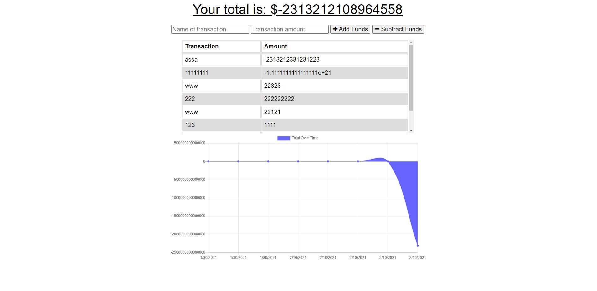

# Budget Tracker

# Description

This project is a budget tracker it lets you update your budget online or offline. The user will be able to add expenses and deposits to their budget with or without a connection. When entering transactions offline, they should populate the total when brought back online.

# Deployed Application

https://github.com/tonycrosby-tech/19_Budget_Tracker - Couldn't get it to deploy

# Table of Contents

- [Installations](#Installations)
- [Screenshots](#Screenshots)
- [Usage](#Usage)
- [License](#License)
- [Credits](#Credits)
- [Test](#Test)
- [Contributing](#Contributing)

# Installations

> npm i

# Screenshots

# Usage

AS AN avid traveller
I WANT to be able to track my withdrawals and deposits with or without a data/internet connection
SO THAT my account balance is accurate when I am traveling

# License

MIT

# Credits

Tony Crosby

# Test

No test command implemented but in the future there should be.

# Contributing

Commit early and often!
